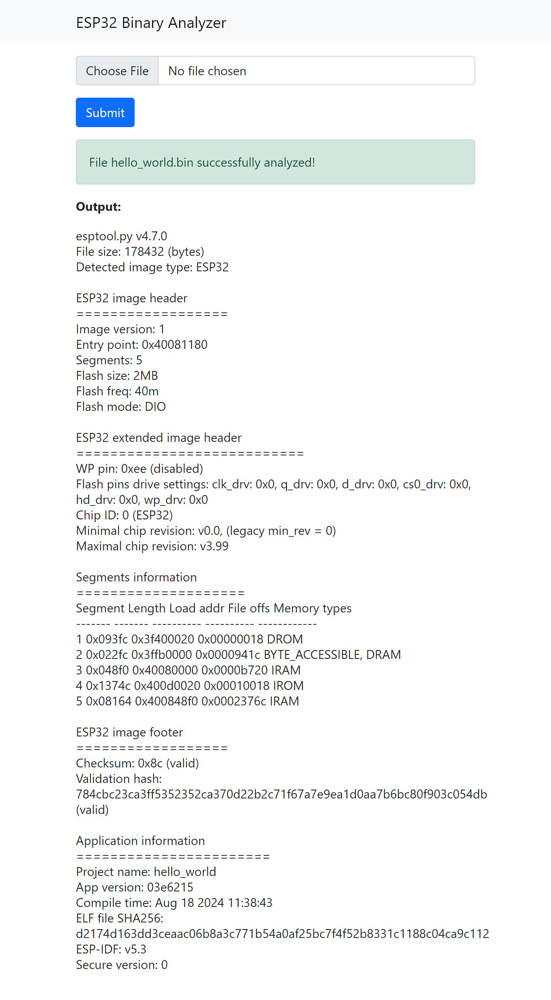

# ESP32 Web App

This is a simple web application to display information about ESP32 binaries.
Users can upload a binary file and receive information such as the project
name, compile time, and ESP-IDF version directly from within their web browser.

The binary analyzer uses the official [espressif/esptool](https://github.com/espressif/esptool)
utility that runs integrated into a Python backend built with Flask.

## Screenshot

The screenshot below shows the output from a successfully analyzed binary.



## Project structure

- `app` - web application built with Flask
- `examples/hello_world` – simple example application for ESP32 that can be
analyzed
- `tests` - collection of unit and integration tests

## Using Docker to build the example application for ESP32

To avoid having to install the complete `ESP-IDF` toolchain on your machine, you
can use a pre-built `Docker` image that includes all required dependencies.

From within [`examples/hello_world`](examples/hello_world), run the following
command from a `Powershell` prompt to build the binaries for the `hello_world`
application:

```Powershell
docker run --rm -v ${PWD}:/project -w /project -e HOME=/tmp -e IDF_TARGET='esp32' espressif/idf:release-v5.3 idf.py build
```

Refer to the [relevant parts of the ESP-IDF documentation](https://docs.espressif.com/projects/esp-idf/en/stable/esp32/api-guides/tools/idf-docker-image.html)
for details on how to use the ESP-IDF Docker image.

## Running the project locally

You can use this project locally on your machine. From within a [Python virtual environment](https://docs.python.org/3/library/venv.html),
install the required packages (listed in
[`requirements.txt`](requirements.txt)):

```Powershell
pip install -r requirements.txt
```

And start the development server by typing:

```Powershell
flask run
```

You can then visit [http://127.0.0.1:5000/](http://127.0.0.1:5000/) in your browser
to try out the application.

## Tests

The application is covered by a set of unit and integration tests. To run
the tests, execute the following command from the top level directory:

```Powershell
pytest -v
```

## CI/CD Pipeline

Both the build of the example application and the tests run automatically as
part of a CI/CD pipeline on every pull request. See [`.github/workflows/main.yml`](.github/workflows/main.yml)
for details.
