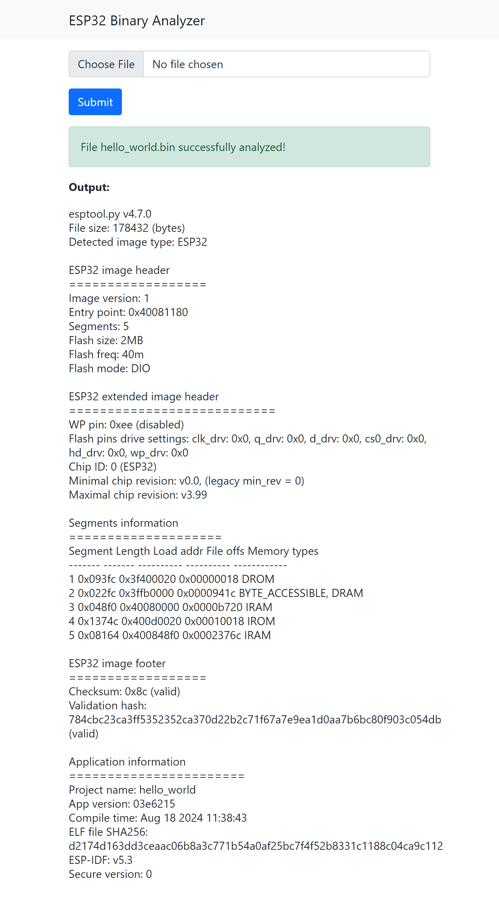

# ESP32 Web App

This web application allows users to upload ESP32 binary files and extract
useful information such as the project name, compile time, and ESP-IDF version
directly within their browser.

The binary analyzer uses the official [espressif/esptool](https://github.com/espressif/esptool)
utility that runs integrated into a Python backend built with Flask.

## Screenshot

Below is a screenshot showing the output of a successfully analyzed binary:



## Project structure

- `app/` - web application built with Flask
- `examples/hello_world/` – example application for ESP32 for analysis
- `scripts/` - utility scripts
- `tests/` - collection of unit and integration tests

## Using Docker to build the example application for ESP32

To avoid having to install the complete `ESP-IDF` toolchain on your machine, you
can use a pre-built `Docker` image that includes all required dependencies.

Run the following command from a terminal to build the binaries for the `hello_world`
application:

```bash
docker compose run --rm idf-build
```

After the build has completed, you can then find the binary under `examples/hello_world/build/hello_world.bin`.

## Running the project locally

You can run this project locally using Docker. First, build the Docker image
from the project's root directory:

```bash
docker build -t flask-app .
```

Once the image is built, run the application inside the container:

```bash
docker run --rm -p 5000:5000 flask-app
```

This will start the Flask app in a Docker container, mapping port `5000` in the
container to port `5000` on your host machine. You should see the following logs
appearing in your terminal:

```text
[2026-04-21 01:08:17 +0000] [1] [INFO] Starting gunicorn 25.3.0
[2026-04-21 01:08:17 +0000] [1] [INFO] Listening at: http://0.0.0.0:5000 (1)
[2026-04-21 01:08:17 +0000] [1] [INFO] Using worker: sync
[2026-04-21 01:08:17 +0000] [7] [INFO] Booting worker with pid: 7
[2026-04-21 01:08:17 +0000] [8] [INFO] Booting worker with pid: 8
[2026-04-21 01:08:17 +0000] [9] [INFO] Booting worker with pid: 9
[2026-04-21 01:08:17 +0000] [10] [INFO] Booting worker with pid: 10
[2026-04-21 01:08:17 +0000] [1] [INFO] Control socket listening at /root/.gunicorn/gunicorn.ctl
```

You can then access the application in your web browser at the following URL:

```text
http://127.0.0.1:5000/
```

## Tests

Once the image is built (see above), run the tests inside the container:

```bash
docker run --rm flask-app pytest -v tests
```

Expected output:

```text
============================= test session starts ==============================
platform linux -- Python 3.11.15, pytest-8.3.2, pluggy-1.5.0 -- /usr/local/bin/python3.11
cachedir: .pytest_cache
rootdir: /appdir
collecting ... collected 12 items

tests/test_api.py::test_index_page PASSED                                [  8%]
tests/test_api.py::test_bin_file PASSED                                  [ 16%]
tests/test_api.py::test_elf_file PASSED                                  [ 25%]
tests/test_api.py::test_fake_bin_file PASSED                             [ 33%]
tests/test_api.py::test_no_file PASSED                                   [ 41%]
tests/test_api.py::test_large_file PASSED                                [ 50%]
tests/test_basics.py::test_app_is_testing PASSED                         [ 58%]
tests/test_functions.py::test_empty_filename PASSED                      [ 66%]
tests/test_functions.py::test_with_filename PASSED                       [ 75%]
tests/test_functions.py::test_exception_thrown PASSED                    [ 83%]
tests/test_functions.py::test_esp_get_info_success PASSED                [ 91%]
tests/test_misc.py::test_is_file_allowed PASSED                          [100%]

============================== 12 passed in 0.14s ==============================
```

## CI/CD Pipeline

Both the build of the example application and the tests run automatically as
part of a CI/CD pipeline on every pull request. See [`.github/workflows/main.yml`](.github/workflows/main.yml)
for details.
